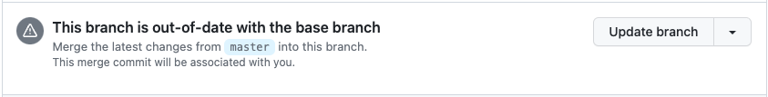

# Up to date action

Keep your pull request up to date when the target branch changes.

## Why?

This action was created on the need to keep all the PRs up to date, so they would always be tested on latest.

When a repo has too many PRs, it can became a bit troublesome to keep all the PRs up to date.

It basically does the same thing as pressing the following button:



## Configuration

```yml
name: Up to date

on:
  push:
    branches:
      - 'main'

jobs:
  updatePullRequests:
    runs-on: ubuntu-latest
    steps:
      - name: Update all the PRs
        uses: paritytech/up-to-date-action@main
        with:
          GITHUB_TOKEN: ${{ secret.PAT }}
          REQUIRE_AUTO_MERGE: true
```

### Inputs

#### `GITHUB_TOKEN`
- Required
- Has to be a [Personal Access Token](https://github.com/settings/tokens/) with `repo` permissions.
  - It can not be GitHub's action token because a push made by an action secret does not trigger new actions (and the new tests would not be triggered)
    - [Related reading](https://github.com/orgs/community/discussions/25702#discussioncomment-3248819)

##### Using a GitHub app instead of a PAT
In some cases, specially in big organizations, it is more organized to use a GitHub app to authenticate, as it allows us to give it permissions per repository and we can fine-grain them even better. If you wish to do that, you need to create a GitHub app with the following permissions:
- Repository permissions:
	- Pull Requests
		- [x] Write
    - Contents
        - [x] Write

Because this project is intended to be used with a token we need to do an extra step to generate one from the GitHub app:
- After you create the app, copy the *App ID* and the *private key* and set them as secrets.
- Then you need to modify the workflow file to have an extra step:
```yml
    steps:
      - name: Generate token
        id: generate_token
        uses: tibdex/github-app-token@v1
        with:
          app_id: ${{ secrets.APP_ID }}
          private_key: ${{ secrets.PRIVATE_KEY }}
      - name: Update all the PRs
        uses: paritytech/up-to-date-action@main
        with:
          # The previous step generates a token which is used as the input for this action
          GITHUB_TOKEN: ${{ steps.generate_token.outputs.token }}
```

### REQUIRE_AUTO_MERGE

If **only** Pull Request that have the [`auto-merge`](https://docs.github.com/en/pull-requests/collaborating-with-pull-requests/incorporating-changes-from-a-pull-request/automatically-merging-a-pull-request) feature enabled should be updated.

It defaults to `true`.

## Development
To work on this app, you require
- `Node 18.x`
- `yarn`

Use `yarn install` to set up the project.

`yarn build` compiles the TypeScript code to JavaScript.

## Deployment
To deploy a new version you need to update two files:
- [`package.json`](./package.json): Update the version number.
- [`action.yml`](./action.yml): Update the image number in `runs.image`.
**Important**: Both versions must have the same number.

When a commit is pushed to the main branch and the versions have changed, the system will automatically tag the commit and release a new package with such version.

You can find all the available versions in the [release section](../releases).
